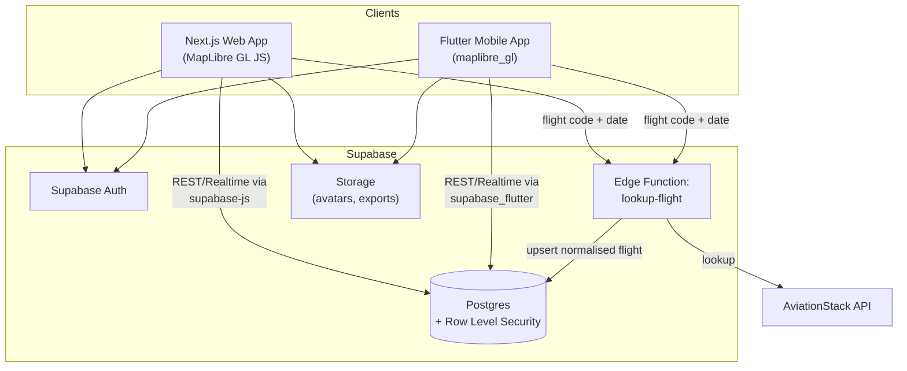

# FlightPath — Architecture

## 1. Overview

FlightPath lets a user log flights (by flight code or manually), and renders every
flight as an arc on a world map — colour-coded by airline, animated while the
flight is in the air, solid once it lands. Flights accumulate over time into a
personal travel-history map.

Two client apps (web + mobile), one backend (Supabase), one shared data model.

## 2. System diagram



## 3. Why this stack

| Decision | Choice | Why |
|---|---|---|
| Backend | Supabase | Postgres + Auth + Storage + Edge Functions in one, permanent free tier, no card required |
| Web | Next.js on Vercel | Hobby tier free indefinitely, no card, trivial CI/CD via GitHub → Vercel integration |
| Mobile | Flutter (separate native app), sideloaded APK | Full native performance/control; skipping Play Store ($25) / App Store ($99/yr) listing keeps it $0 |
| Map | **MapLibre GL** (open-source, not Mapbox) + **OpenFreeMap** tiles | Zero signup, zero API key, zero usage cap — no billing relationship exists to ever hit a limit on |
| Flight data | AviationStack | Free plan (100 req/month, no card) — combined with the Edge Function's cache, a personal trip log won't come close to the cap |
| Flight-key protection | Edge Function proxy | AviationStack key never touches the client; also lets us normalise + cache lookups in Postgres |

**Cost ceiling: $0.** Every component above has a genuinely free, no-card-required
tier, not a trial. The only real-world cost you could hit is an official app
store listing (Play/App Store) — sidestepped by sideloading the CI-built APK
instead. See `ADR-0002-free-stack.md` for the full reasoning.

Full stack decision rationale, alternatives considered, and trade-offs are in
`ADR-0001-tech-stack.md`.

## 4. Core data flow: adding a flight

1. User enters a flight code (e.g. `SQ308`) + date, **or** fills origin/destination/airline manually.
2. Client calls the `lookup-flight` Edge Function.
3. Edge Function:
   - Checks Postgres cache (`flight_lookups`) for a recent hit on that code+date.
   - If missing/stale, calls AviationStack, normalises the response (airline, IATA codes, sched/actual times, live status).
   - Returns normalised data to the client; client shows a confirm/edit screen (manual override) before saving.
4. Client writes a row to `flights` (owned by `user_id`, protected by RLS).
5. Client subscribes to Supabase Realtime on `flights` so status flips (`scheduled → in_transit → completed`) update the map live without a refresh, on whichever device/tab is open.

## 5. Status → rendering rules

| Status | Trigger | Rendering |
|---|---|---|
| `scheduled` | `now < departure_time` | Faint/greyed preview arc, no animation |
| `in_transit` | `departure_time <= now < arrival_time` | Dashed arc, animated dash-offset; a plane icon interpolated along the great-circle path at `(now - departure_time) / (arrival_time - departure_time)` |
| `completed` | `now >= arrival_time` | Solid arc in the airline's brand colour, added permanently to the accumulated map |
| `cancelled` | manual/AviationStack flag | Excluded from map by default, visible in list view |

No live ADS-B feed is used (per your call) — "real time" here means the arc's
visual state reacts to wall-clock time relative to scheduled/actual
departure–arrival, recalculated on every client render / realtime push, not
actual live aircraft GPS.

## 6. Repo layout

```
flightpath/
├── apps/
│   ├── web/          # Next.js app
│   └── mobile/        # Flutter app
├── supabase/
│   ├── migrations/    # SQL schema, versioned
│   ├── functions/     # Edge Functions (lookup-flight)
│   └── config.toml
├── docs/               # this folder
└── .github/workflows/  # CI/CD
```

## 7. v2: stats, geography, airline/aircraft breakdowns, social

The feature set grew significantly beyond the v1 map — trip statistics,
percentile ranking against other users, geographic/airline/aircraft
breakdowns, content export, and a consent-based compatibility quiz. This
moved the product from "personal tool" to "real multi-user product," which
has real privacy implications for anything that compares users. See:

- `ADR-0003-multiuser-scope.md` — the decisions and why
- `FEATURES.md` — what's built vs. stubbed vs. dropped, feature by feature
- `supabase/migrations/0002_stats_and_social.sql`, `0003_compatibility.sql` — schema

Non-goals unchanged from v1 remain non-goals; monetization (data-unlock
nudges, membership badges) was evaluated and explicitly dropped.
