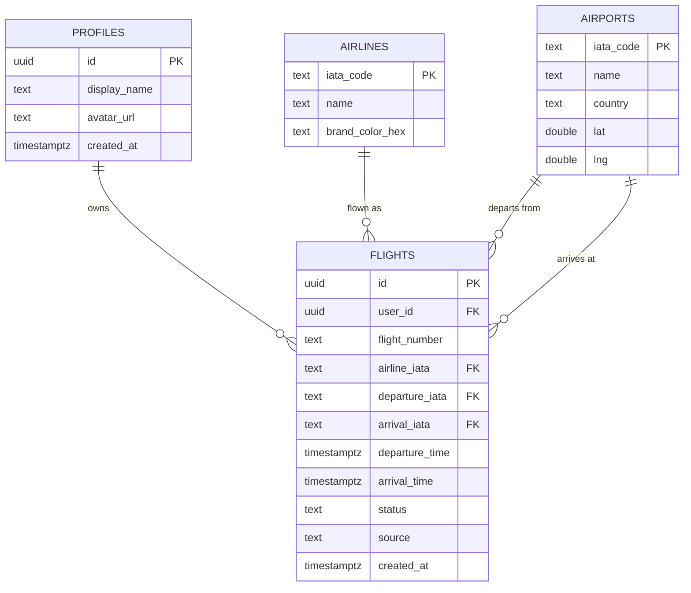

# FlightPath — Data Model

Postgres schema, owned by Supabase. RLS enforced on every user-owned table:
a user can only read/write rows where `user_id = auth.uid()`.

## Entity overview

## Why these tables

- **`airlines`** and **`airports`** are shared reference tables (not per-user) —
  looked up once via AviationStack or a static IATA dataset, reused across
  every user. Keeps colour mapping and coordinates consistent and avoids
  re-fetching the same airport lat/lng every time.
- **`flights`** is the only user-owned table. One row = one flight leg (one
  arc on the map). Multi-leg trips are just multiple `flights` rows with
  close dates — no separate "trip" grouping table in v1, since your examples
  (India→SG, SG→AUS, AUS→US) are each independent legs, possibly a year
  apart. Easy to add a `trips` grouping table later without migration pain.
- **`source`** (`auto` | `manual`) records whether a row came from the
  AviationStack lookup or was hand-entered — useful for debugging bad
  lookups and for your "auto-lookup with manual override" flow.
- **No stored geometry.** Great-circle arcs are computed client-side from
  `airports.lat/lng` (via turf.js on web, a Dart great-circle util on
  mobile) — cheaper than storing/recalculating GeoJSON server-side, and the
  arc is deterministic from the two endpoints anyway.

## Migration file

See `supabase/migrations/0001_init.sql` for the actual DDL, including RLS
policies and the `flight_lookups` cache table used by the Edge Function.
